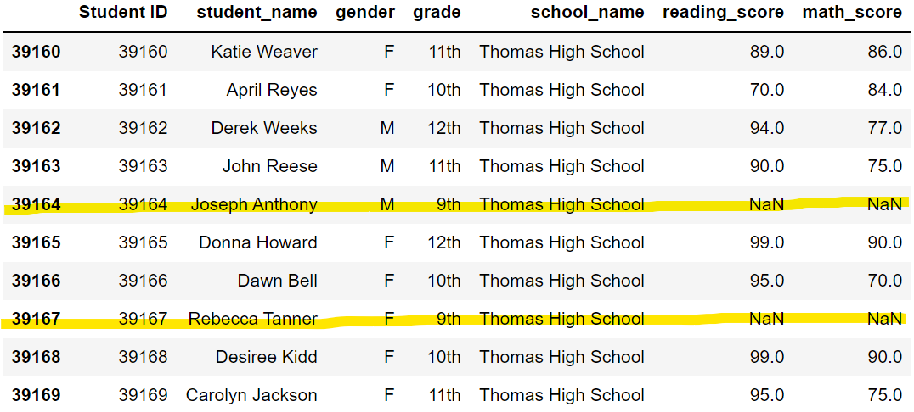
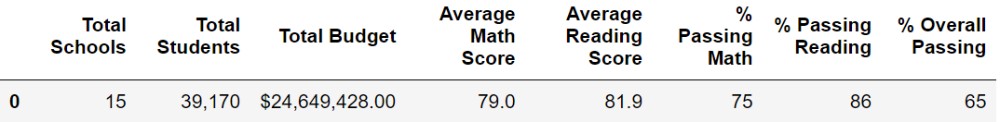
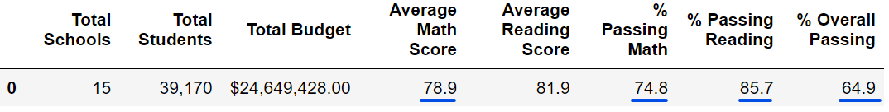
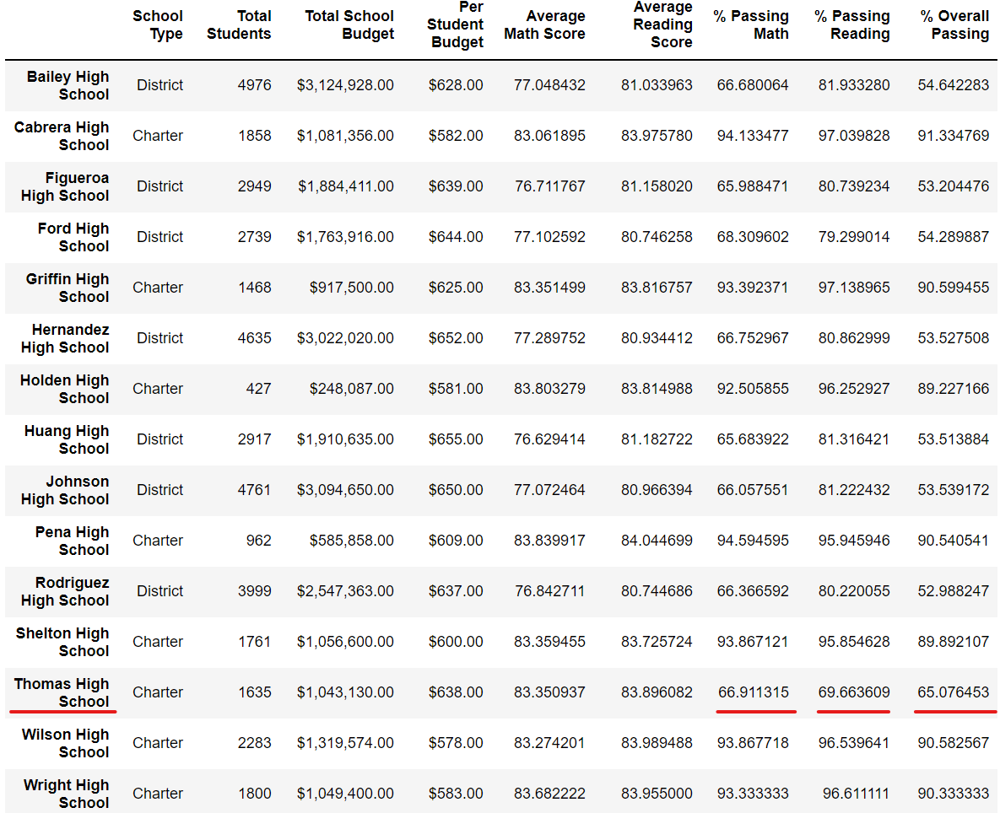
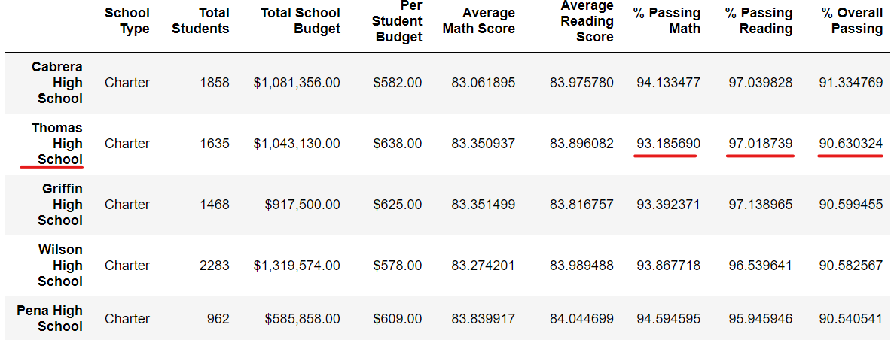
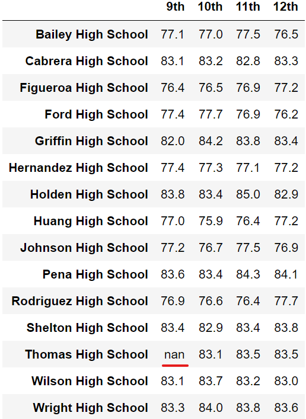
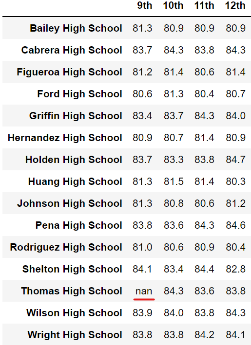
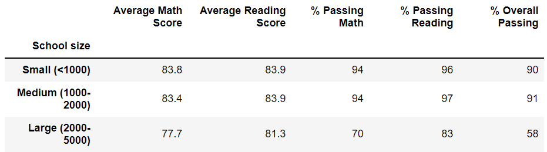
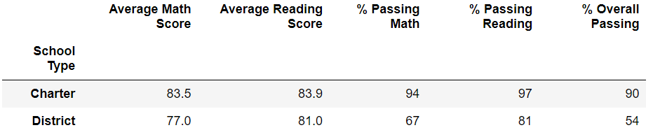
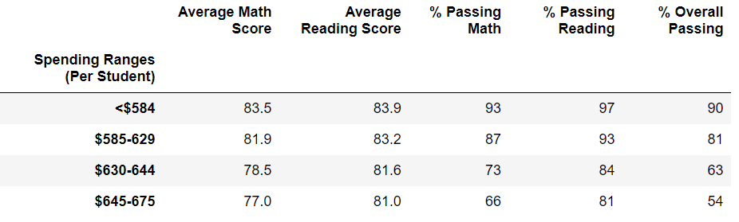

# School_District_Analysis

## Overview of the Project
A school board is looking to analyze its districts' school data to make meaningful decisions with budgeting and allocating of resources. Maria is the chief data scientist in charge of this project. After the initial report was completed, the school board notified Maria that there has been some data tampering that's happened at one of the schools. Thomas High School's ninth grade class data appears to have been altered. Due to this new piece of evidence, the ninth grade math and reading data at Thomas High School cannot be counted. A new report must be generated without the specify data to uphold state-testing standards.   

## Results
There were a total of 461 ninth grade students at Thomas High School whose math and reading data points were not counted in the new report. These students were still counted as part of the total student population though. Below is a table verifying that these data points were taken out. All ninth grade students had their math and reading scores replaced with "NaN".

### How the data impacted at the district level
The 461 students represented approximately 1.2% of the total district population, which is 39,170. The impact of removing these student data were very minimal when looking at the bigger picture. The following are the changes within the data before and after the data points were taken out:

| Before  |  |
| :---: | :---:   |
| After   |  |

### How the data impacted at the school level
Initially, Thomas High School was ranked near the bottom with it comes to the overall passing percentage at 65.1%. After the ninth grade data were taken out, Thomas High School has risen up to be a top 5 school, with a overall passing percentage at 90.6%. This is a significant change in the percentage increase. The ninth grade student population accounts for 28.2% of Thomas High School's population. 

| School Ranking Before | School Ranking After |
| :---:    | :---:  |     
|   |   |

#### Average Math and Reading Scores by School
The following tables showed the average score of each school by grade level. Ninth grade data at Thomas High School were not counted.
| Average Math Score | Average Reading Score |
| :---:    | :---:  |     
|   |   |

## Summary
Based on the data, small and medium size schools tend to do better on the overall passing percentage than large schools. There is a significant difference in the data. Large school average 58% while small and medium size school scored 90% and 91%, respectively. 

When comparing the different school types, Charter schools tend to do better than district schools. Charter schools scored 90% on the overall passing perentage while district schools scored 54%. Charter school's average math score is also 6.5 points higher than district schools.

Surprisingly, more money spent per student does not correlate with an increase in overall passing percentage. This actually has a negative correlation with less money spent leading to an increase in overall passing percentage. The student/teacher ratio and the size of small schools may explain this scenario. 

